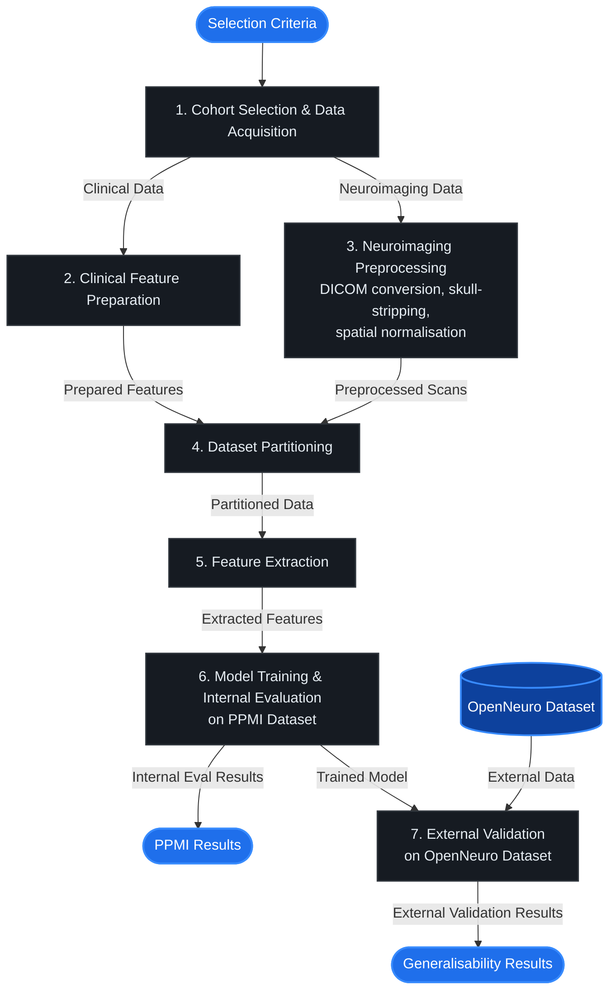

# Multimodal Neuroimaging Classification for Parkinson's Disease

> *MSc Data Science Dissertation Thesis*  
> *Department of Information, Journalism & Communication, The University of Sheffield*  
> *Author: Iulia Sapungiu | Supervisor: Dr. Asra Aslam*  
> *Academic Year: 2025/2026*

This repository contains the complete end-to-end Machine Learning (ML) and Deep Learning (DL) neuroimaging pipeline for classifying Parkinson's Disease (PD) versus Healthy Controls (HC). 
The study evaluates a multimodal approach combining T1-weighted structural MRI scans and harmonized clinical features using **3D Convolutional Neural Networks (3D CNNs)**, **Random Forest (RF)**, and **Logistic Regression (LR)** models.

* **Internal Cohort:** Parkinson's Progression Markers Initiative (PPMI)
* **External Validation Cohort:** OpenNeuro Dataset

---

## 📋 Table of Contents
* [💻 Computational Requirements](#-computational-requirements)
* [🚀 Quick Start and Installation](#-quick-start-and-installation)
* [🔄 Pipeline & Model Workflow](#-pipeline--model-workflow)
* [⚙️ Computational Pipeline Execution](#️-computational-pipeline-execution)
* [📊 Key Results Summary](#-key-results-summary)
* [📁 Repository Structure](#-repository-structure)
* [⚖️ Data Governance & Compliance](#%EF%B8%8F-data-governance--compliance)
* [👤 Author & Acknowledgements](#-author--acknowledgements)

## 💻 Computational Requirements

* **Preprocessing (NIfTI Conversion, Skull Stripping, Registration):** GPU acceleration recommended (e.g., HD-BET for automated skull stripping). Tested and executed on the **Stanage HPC cluster** (University of Sheffield) using NVIDIA GPUs with CUDA support.
* **3D CNN Model Training:** High-performance GPU required. Training averaged **~77 seconds per epoch** on a Stanage NVIDIA GPU node.
* **Classical Machine Learning (RF, LR):** CPU execution is sufficient for radiomic feature scaling, tabular model fitting, and cross-validation.

## Quick Start and Installation
1. Clone the repository
  ```bash
  git clone [https://github.com/IuliaSapungiu/parkinsons-mri-classification.git](https://github.com/IuliaSapungiu/parkinsons-mri-classification.git)
  cd parkinsons-mri-classification
  ```

2. Set up Virtual Environment
  ```bash
  # Create environment
  python -m venv myenv

  # Activate on Windows (Git Bash):
  source myenv/Scripts/activate

  # Activate on Linux/macOS:
  source myenv/bin/activate
  ```
3. Install dependencies
  ```bash
  pip install --upgrade pip
  pip install -r requirements.txt
  ```

## ⚙️ Computational Pipeline Execution
The pipeline scripts located in `scripts/` are numerically indexed to ensure exact reproduction of the experimental workflow:

| Stage | Script(s) | Description |
| :--- | :--- | :--- |
| **0. OpenNeuro Prep** | `00_extract_openneuro.py`<br>`00b_preprocessing.py`<br>`00b_verify_openneuro.py` | Extracts, cleans, and verifies external validation scans and metadata. |
| **1. PPMI Clinical & Data Prep** | `01_PPMI_extraction.py`<br>`01b_PPMI_clinical_data_prep.py`<br>`02_PPMI_MRI_transform.py` | Cohort selection, harmonization of MDS-UPDRS/demographics, DICOM-to-NIfTI conversion. |
| **2. Preprocessing & Registration** | `03_skull_strip.py`<br>`04_registration.py` | Automated skull stripping and spatial normalization to standard MNI152 space. |
| **3. Dataset Splitting** | `05_splitting.py` | Stratified 70/15/15 train/validation/test cohort partitioning. |
| **4. Feature Extraction & Prep** | `06a_extract_features.py`<br>`06b_preprocessing.py` | Radiomic atlas feature extraction, scaling, and missing value imputation. |
| **5. PPMI Model Training** | `07_train_ml_ppmi.py`<br>`08_train_3d_cnn.py` | Internal training and cross-validation for classical ML (RF, LR) and 3D CNN architectures. |
| **6. External Validation** | `09_openneuro_skull_strip.py`<br>`10_openneuro_registration.py`<br>`11_openneuro_extract_features.py`<br>`12_openneuro_ml.py`<br>`13_openneuro_3dcnn.py` | Execution of skull stripping, registration, feature extraction, and model inference on OpenNeuro. |

## 🔄 Pipeline & Model Workflow



## 📊 Key Results Summary

| Model | Cohort | Configuration | Accuracy | Key Findings |
| :--- | :--- | :--- | :--- | :--- |
| **Random Forest** | PPMI (Internal) | Multimodal Full | 62.22% | Highest internal accuracy; HC recall 0.78 but PD recall only 0.45 — asymmetric error profile |
| **Logistic Regression** | PPMI (Internal) | Multimodal Full | 60.00% | More balanced error profile than RF; PD recall 0.68 vs RF's 0.45 |
| **3D CNN** | PPMI (Internal) | Multimodal | 60.00% | Most balanced errors (HC 0.61 / PD 0.59); no hand-engineered features required |
| **Random Forest** | OpenNeuro (External) | Multimodal Full | 76.09% | Best external generalisation; balanced accuracy 77.24% with Z-score harmonisation |
| **Logistic Regression** | OpenNeuro (External) | Multimodal Full | 71.74% | Most clinically balanced external result; HC recall 0.71 / PD recall 0.72 |
| **3D CNN** | OpenNeuro (External) | Multimodal | 57.00% | Generalisation failure — predicted PD for 45/46 subjects; HC recall 0.05 |

## 📁 Repository Structure

```text
PD/
├── openneuro/                                ← External validation raw dataset scans
├── raw/                                      ← Raw clinical and acquisition metadata
│   ├── Code_List_Harmonized_09June2026.csv
│   ├── Data_Dictionary_Harmonized_09June2026.csv
│   ├── demographics.csv                      ← OpenNeuro clinical metadata
│   ├── MDS-UPDRS_Part_III_09Jun2026.csv      ← PPMI clinical metadata
│   ├── PPMI_Baseline_T1_MRI.csv              ← PPMI scan acquisition metadata
│   └── PPMI_Curated_Data_Cut_Public_20251112.xlsx ← PPMI curated clinical dataset
├── processed_data/                           ← Preprocessed features, splits & logs
│   ├── extracted_features/                   ← Radiomic feature matrices (PPMI internal)
│   ├── openneuro_extracted_features/         ← Radiomic feature matrices (OpenNeuro external)
│   ├── HC/                                   ← Raw PPMI DICOM directories
│   ├── PD/                                   ← Raw PPMI DICOM directories
│   ├── split_data/                           ← Stratified PPMI dataset split definitions
│   │   ├── train_clinical.csv
│   │   ├── val_clinical.csv
│   │   └── test_clinical.csv
│   ├── skull_stripped/                       ← Brain-extracted scans & logs (PPMI)
│   ├── openneuro_skull_stripped/             ← Brain-extracted scans & logs (OpenNeuro)
│   ├── registration/                         ← MNI152 registered scans (PPMI)
│   ├── openneuro_registered/                 ← MNI152 registered scans (OpenNeuro)
│   ├── nifti/                                ← Initial NIfTI conversions
│   ├── openneuro_clinical_variables.csv      ← Cleaned OpenNeuro clinical features
│   ├── ppmi_harmonized_clinical_variables.csv← Processed PPMI clinical features
│   ├── pd_demographics_clean.csv             ← Cleaned demographic dataset
│   ├── selected_subjects.txt                 ← Subject selection ID list
│   └── registration_example.png              ← Preprocessing visual QA sample
├── scripts/                                  ← Sequential pipeline scripts & split metadata
│   ├── 00_extract_openneuro.py
│   ├── 00b_preprocessing.py
│   ├── 00b_verify_openneuro.py
│   ├── 01_PPMI_extraction.py
│   ├── 01b_PPMI_clinical_data_prep.py
│   ├── 02_PPMI_MRI_transform.py
│   ├── 03_skull_strip.py
│   ├── 04_registration.py
│   ├── 05_splitting.py
│   ├── 06a_extract_features.py
│   ├── 06b_preprocessing.py
│   ├── 07_train_ml_ppmi.py
│   ├── 08_train_3d_cnn.py
│   ├── 09_openneuro_skull_strip.py
│   ├── 10_openneuro_registration.py
│   ├── 11_openneuro_extract_features.py
│   ├── 12_openneuro_ml.py
│   ├── 13_openneuro_3dcnn.py
│   ├── selected_subjects_public.csv
│   ├── train_subjects.pkl
│   └── test_subjects.pkl
├── results/                                  ← Model evaluation plots & figures
│   └── figures/
├── .gitignore                                ← Git tracking rules
├── requirements.txt                          ← Python dependencies
└── README.md                                 ← Repository documentation
```

## ⚖️ Data Governance & Compliance
To strictly comply with the Parkinson's Progression Markers Initiative (PPMI) Data Usage Agreement and GitHub file size constraints:
* **Excluded from repository:**
  * Raw DICOM scan directories (`HC/`, `PD/`, `openneuro/`)
  * Intermediate NIfTI 3D image volumes (`nifti/`, `skull_stripped/`, `registration/`)
  * Heavy binary model checkpoints and weights (`models/`)
* **Included in repository:**
  * Complete Python source code and execution scripts (`scripts/`)
  * Preprocessing configurations and environment definition (`requirements.txt`)
  * Anonymized tabular radiomic feature matrices (`processed_data/extracted_features/`, `processed_data/openneuro_extracted_features/`)
  * Subject cross-validation split files (`.pkl`, `.csv`)
  * Quantitative evaluation plots, metric curves, and confusion matrices (`results/figures/`)
 
## 👤 Author & Acknowledgements

* **Author:** Iulia Sapungiu
* **Degree Program:** MSc Data Science / Health Data Analytics
* **Institution:** Department of Computer Science, University of Sheffield
* **HPC Resources:** High-Performance Computing (Stanage Cluster) provided by the University of Sheffield.
* **Data Sources:** Datasets provided by the [Parkinson's Progression Markers Initiative (PPMI)](https://www.ppmi-info.org/) and [OpenNeuro](https://openneuro.org/).

> **Data Access Note:** Access to raw MRI scans and primary clinical datasets must be obtained directly through the official portals for [PPMI](https://www.ppmi-info.org/) and [OpenNeuro]([https://openneuro.org/](https://openneuro.org/datasets/ds001907/versions/3.0.2). This work was supported by the Northern, Yorkshire and Humberside Digital Informatics Forum (NYHDIF) Bursary Award Scheme, University of Sheffield.

> **If you use this code or methodology, please cite:**
*Sapungiu, I. (2026). AI-Based Classification of Early-Stage 
Parkinson's Disease from Structural Neuroimaging: A Multimodal 
Comparative Study. MSc Dissertation, University of Sheffield.*

###### All rights reserved © Iulia Sapungiu
